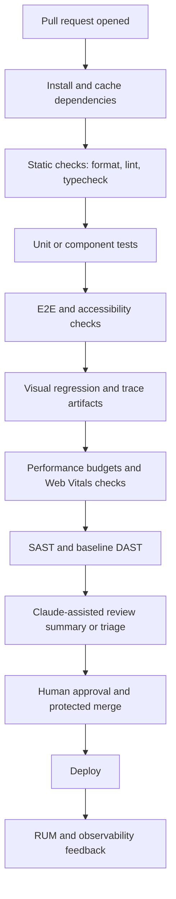

# Claude Code design skills and workflows for frontend quality in 2026

## Executive Summary

For frontend teams in 2026, the strongest way to use Claude Code is not as a “magic code writer”, but as a tightly-governed engineering copilot inside a verification-first delivery system. Official entity["company","Anthropic","ai company"] documentation now describes Claude Code as an agentic coding tool that can read a codebase, edit files, run commands, integrate with development tools, use hooks, subagents, MCP connections, routines, IDE integrations, and usage monitoring. Between June 2024 and April 2026, Anthropic’s model releases materially improved agentic coding, long-horizon planning, instruction following, and context capacity, culminating in Sonnet 4.6 and Opus 4.7 era workflows that are much more suitable for multi-step frontend quality pipelines than the 2024 generation. citeturn20view0turn20view2turn20view3turn20view4turn20view7turn20view8turn20view9turn20view10turn20view11turn20view12turn22view14turn21view5turn10search6

The report’s core conclusion is that the best “Claude Code design skills” are really workflow design skills: defining success criteria, decomposing work into explore-plan-implement-review phases, grounding the model with retrieval and tools, managing context aggressively, and refusing to trust generated code until it has passed machine-verifiable checks. Anthropic’s own best-practice guidance is explicit that the highest-leverage move is to give Claude tests, screenshots, or expected outputs so it can verify its own work; the company also stresses context management, subagents, and parallel writer/reviewer sessions. citeturn31view1turn31view2turn31view3turn31view4

For frontend quality specifically, the recommended default operating model is: local Claude-assisted development in the IDE or terminal; deterministic hooks for formatting, linting, and light tests; a separate reviewer session or subagent for PR critique; then CI gates for unit/component tests, browser tests, visual regression, accessibility, performance budgets, and security scanning. This architecture maps cleanly onto official tooling from Playwright, Cypress, Jest, Testing Library, ESLint, Prettier, Lighthouse CI, CodeQL, ZAP, and modern CI platforms such as entity["company","GitHub","developer platform"] Actions, entity["company","GitLab","devops company"] CI/CD, and Bitbucket Pipelines from entity["company","Atlassian","software company"]. citeturn24view5turn24view6turn24view7turn24view8turn24view9turn24view10turn24view11turn24view12turn26view8turn28view1turn28view2turn26view13turn26view14turn26view12

Because your team size, budget, and current stack were not specified, the recommendations below are designed to be stack-agnostic and modular. They assume a modern TypeScript-heavy product organisation with branch protection and CI already in place, but they can be scaled down for a small team or up for a regulated enterprise. The strongest universal recommendation is to start with Sonnet-class day-to-day workflows and add higher-cost review, long-context, or advisor patterns only where they measurably reduce escaped defects or review latency. citeturn21view0turn22view14turn7search9turn30view2turn30view3

## Claude Code capability baseline in 2026

Claude Code’s practical value for frontend quality comes from the combination of model capability and engineering affordances. The current product is broader than “prompt in, code out”: it supports terminal and IDE work, inline diffs, git operations, hooks, subagents, MCP tool connections, cloud routines, and monitoring counters for PRs, commits, tokens, and cost. It is much better understood as a programmable coding environment than as a single chat interface. citeturn20view0turn20view2turn20view3turn20view4turn20view5turn20view7turn20view8turn20view9

### Release timeline with implications for frontend engineering

| Period | Release or feature | Why it matters for frontend quality |
|---|---|---|
| June 2024 | Claude 3.5 Sonnet | Anthropic reported that Claude 3.5 Sonnet solved 64% of problems in an internal agentic coding evaluation and could independently write, edit, and execute code when given tools. That is the first clear official milestone where “generate code, run tests, iterate” became credible rather than purely aspirational. citeturn20view10 |
| October 2024 | Upgraded Claude 3.5 Sonnet plus computer use | Anthropic said the upgraded 3.5 Sonnet delivered particularly significant gains in coding and introduced computer use, which widened automation beyond pure source code editing into browser- and desktop-like workflows. This matters for UI verification and web app workflows. citeturn3search3turn1search14 |
| February 2025 | Claude 3.7 Sonnet and Claude Code | Anthropic positioned Claude 3.7 Sonnet as strong at agentic coding and introduced extended thinking with a configurable thinking budget. For frontend teams, that made tricky refactors, debugging, and “explain-first” planning more reliable. citeturn20view11turn3search5 |
| May 2025 | Claude 4 family | Anthropic reported Sonnet 4 at 72.7% on SWE-bench and highlighted improved steerability. For engineering managers, the key point is not the benchmark itself but that steerability improved, which directly affects spec compliance, migration work, and refactors. citeturn20view12 |
| September 2025 | Sonnet 4.5 | Anthropic described Sonnet 4.5 as its best coding model at the time, strongest for building complex agents, and best at computer use. This is the point where multi-stage coding workflows became an explicit product theme, not just a model side effect. citeturn21view0 |
| February 2026 | Sonnet 4.6 | Sonnet 4.6 is described as a full upgrade across coding, computer use, long-context reasoning, agent planning, knowledge work, and design, with a 1M-token context window in beta. That especially matters for monorepos, design-system work, wide refactors, migration audits, and long PR reviews. citeturn22view14turn21view2 |
| April 2026 | Opus 4.7 and migration guidance | Anthropic says Opus 4.7 improved resolution by 13% over Opus 4.6 on its 93-task coding benchmark, with faster median latency and stricter instruction following; migration guidance also points to adaptive thinking and 1M context at standard pricing. This is most relevant for hard architecture refactors, systematic review, and advisor-style escalation. citeturn21view5turn10search6 |

Anthropic’s own deprecation notices are also important operationally: as of 14 April 2026, Claude Sonnet 4 and Claude Opus 4 snapshots were scheduled for retirement on 15 June 2026, with Sonnet 4.6 and Opus 4.7 named as replacements. For teams building durable automation, the practical recommendation is to standardise on currently recommended model IDs and treat prompt assets as migratable infrastructure. citeturn10search9

### Capability map for frontend workflows

| Capability area | Official basis | Frontend implication |
|---|---|---|
| Multi-file code generation and refactoring | Claude Code “reads your codebase, edits files, runs commands” and works across multiple files and tools. citeturn20view0 | Suitable for component extraction, route migrations, state-management changes, and test updates spanning many files. |
| Deterministic automation | Hooks run shell commands automatically when Claude edits files or finishes tasks. citeturn20view2 | Use hooks to guarantee format, lint, typecheck, or test execution rather than hoping the model remembers. |
| Parallel investigation and review | Built-in Explore and Plan subagents; parallel writer/reviewer sessions are recommended in Anthropic best practices. citeturn22view8turn31view4 | Separate implementation from review to reduce self-confirmation bias and keep investigation out of the main session context. |
| Retrieval and live tool use | MCP connects Claude Code to tools, databases, APIs, issue trackers, monitoring systems, and even design sources such as Figma. citeturn20view4turn2search9 | Ground code generation in real tickets, design specs, production issues, and analytics rather than stale pasted context. |
| IDE-native pair programming | The VS Code integration provides inline diffs, @-mentions, plan review, and keyboard shortcuts. citeturn20view7 | Good for interactive local work where engineers want to approve changes incrementally. |
| CI/CD automation | Claude Code docs explicitly reference GitHub Actions and GitLab CI/CD for automating code review and issue triage, and routines can trigger on schedules, APIs, or GitHub events. citeturn8search0turn23view7 | Feasible to attach Claude-driven review or changelog/report generation to PR and release workflows. |
| Security and permissions | Claude Code is read-only by default, requires approval for file edits and bash execution, and offers a sandboxed bash tool with filesystem/network isolation. citeturn20view6turn23view0 | Teams can allow meaningful autonomy without giving the agent unconstrained shell access. |
| Observability of usage | Claude Code exports metrics for PRs, commits, tokens, cost, and edit acceptance or rejection. citeturn23view1turn23view3turn23view4 | You can instrument ROI, prompt waste, and acceptance quality instead of arguing from anecdotes. |

The subtle but important takeaway is that frontend quality gains now come less from “ask better prompts” and more from “design a good socio-technical loop”: retrieval, bounded autonomy, deterministic validation, and separate-review patterns are the real force multipliers. Anthropic’s own best-practice and context-engineering guidance strongly support that interpretation. citeturn31view1turn31view2turn30view1

## Design skills to teach and assess in engineers using Claude Code

The strongest engineers in Claude-assisted environments are not those who “chat well”; they are those who can design machine-verifiable work packets, constrain context, and choose the right escalation path between direct prompting, retrieval, tools, and human review. Anthropic’s prompt-engineering guidance is explicit that prompt work starts only after success criteria and evaluation methods are defined. Its consistency and guardrail docs then reinforce retrieval, prompt chaining, and validation as the right way to improve reliability. citeturn5search5turn23view9turn23view10turn23view11

### Recommended skill model

| Skill | What to teach | What “good” looks like | Assessment exercise |
|---|---|---|---|
| Prompt specification | Task, scope, constraints, output format, DoD, and failure conditions | Prompt names target files, constraints, expected outputs, and verification steps instead of asking for “better code” | Give an ambiguous ticket and ask the engineer to rewrite it into a Claude-ready implementation prompt. |
| Prompt chaining | Explore → plan → implement → verify → review → summarise | Engineer naturally splits investigation from coding and coding from review; uses separate sessions or subagents where useful | Hand over a bug plus flaky test suite; assess whether the candidate decomposes before editing. |
| Context engineering | Context is finite; use `/clear`, `/compact`, CLAUDE.md, rules, subagents, checkpoints, and multiple sessions | CLAUDE.md stays concise; the engineer resets context between tasks; large investigations happen in subagents | Ask the engineer to recover from a bloated session without losing critical decisions. citeturn23view6turn23view5turn31view2turn31view3turn31view4 |
| Tool use | When to use bash, text editor, MCP, web/retrieval, and CI evidence | Uses tools to resolve uncertainty instead of asking the model to guess; provides detailed tool descriptions in custom agent setups | Ask the engineer to build a design-to-code workflow with issue tracker plus design source via MCP. citeturn23view12turn5search4turn20view4 |
| Hallucination mitigation | Retrieval grounding, expected outputs, golden tests, second-pass review, and explicit uncertainty | Treats all generated code as provisional until lint, tests, screenshots, and review pass | Present conflicting specs and see whether the engineer grounds the answer in the authoritative source. citeturn31view1turn23view9turn23view10 |
| Safety and guardrails | Permission modes, read-only defaults, sandboxing, input validation, and prompt-injection awareness | Restricts powerful actions; differentiates trusted repo instructions from untrusted external text | Ask the engineer to ingest external bug reports safely without allowing prompt-injected deploy steps. citeturn20view6turn23view0turn23view11 |
| RAG and knowledge grounding | RAG basics, source ranking, document freshness, and authoritative-source selection | Pulls design docs, tickets, monitoring data, and runbooks into the task; does not rely on memory for volatile facts | Give the engineer a stale spec and a newer ticket; assess whether they prefer runtime retrieval. citeturn5search1turn20view4 |
| Operationalisation | Hooks, skills, routines, CI jobs, metrics, and governance | Reusable assets replace one-off prompts; routine work becomes deterministic | Ask the engineer to turn a manual accessibility review into a repeatable hook plus CI gate. citeturn20view2turn20view9turn20view5 |

### Fine-tuning and adapter stance

Anthropic’s public API documentation still says the API does not currently offer fine-tuning. For most frontend teams, that means the practical “adapter layer” is not model retraining but a stack of operational customisation: CLAUDE.md, `.claude/rules/`, skills, subagents, tool descriptions, MCP servers, and prompt assets. In other words, invest first in workflow memory and retrieval architecture, not in bespoke model training. citeturn10search1turn20view1turn1search8turn20view3turn20view4

That has a useful side effect: these customisations are easier to version, review, migrate, and deprecate than a fine-tuned model would be. Given the current retirement cadence of model snapshots, that portability is strategically valuable. citeturn10search9

## End-to-end workflows for frontend quality pipelines

The most robust frontend pipeline in 2026 has three loops, not one: a local development loop, a PR review loop, and a CI/CD enforcement loop. Claude Code should participate in all three, but it should be the primary actor only in the first. In the second and third, deterministic checks and fresh-context review matter more than the model’s convenience. That design is consistent with Anthropic’s verification-first guidance and with contemporary DevOps research emphasising systems, platforms, and measurable delivery outcomes over tool novelty. citeturn31view1turn30view2turn30view3turn28view7

### Recommended local-to-PR workflow


This workflow is not just aesthetically neat; it directly addresses the biggest failure modes. Subagents keep exploratory reads out of the main context, hooks ensure lint and test steps are not skipped, and a fresh reviewer session counters the tendency of a model to defend its own prior work. Anthropic now explicitly recommends both context management and writer/reviewer parallelism. citeturn31view2turn31view3turn31view4

### Recommended CI enforcement flow



This CI shape combines official capabilities from GitHub/GitLab/Bitbucket and common frontend tooling: matrix builds in GitHub Actions, event-driven pipelines in GitLab, parallel steps in Bitbucket, visual and accessibility testing in Playwright/Cypress, performance assertions in Lighthouse CI, CodeQL for SAST, ZAP Baseline for passive DAST, and browser/observability instrumentation via Web Vitals, OpenTelemetry, and Sentry. citeturn26view13turn26view14turn26view12turn24view5turn24view6turn24view7turn24view8turn24view9turn26view8turn27view2turn28view1turn28view2turn28view5turn28view6

### Workflow variants compared

| Variant | Description | Best for | Benefits | Risks |
|---|---|---|---|---|
| Assisted local only | Engineer uses Claude interactively; no hooks; CI remains conventional | Small teams or pilot phase | Lowest change-management cost | Quality gains stay inconsistent; model habits become person-dependent |
| Balanced default | Local Claude + deterministic hooks + fresh reviewer session + CI quality gates | Most product teams | Best balance of speed and quality; auditable | Requires attention to prompt assets and repo conventions |
| High-assurance frontend | Balanced default plus preview environment checks, visual baselines, performance budgets, SAST/DAST, observability feedback, and scheduled routines | Design systems, regulated products, consumer apps with UX sensitivity | Strongest protection against regressions in UI, a11y, and performance | More CI cost and more organisational discipline required |
| Agentic automation heavy | Routines or CI bots perform review, triage, changelogs, and selective patching on events | Mature platform teams only | Scales repetitive work well | Highest governance burden; must avoid silent autonomous failure |

The report’s recommendation, absent budget or team-size constraints, is the balanced default. It is where the marginal quality returns are usually highest before governance and CI costs start to rise sharply. citeturn20view2turn23view7turn30view3

## Toolchains, prompt templates, and code examples

### Toolchain patterns by frontend stack

| Stack | Core implementation pattern | Test stack | A11y and visual | Performance and observability | Notes |
|---|---|---|---|---|---|
| React | Claude for component generation, refactors, and hook cleanup; keep React-specific semantics explicit | React Testing Library plus Jest for component logic and behavioural tests; Playwright for browser flows. React docs now steer teams away from old test-utils patterns and toward Testing Library. citeturn24view2turn12search6turn12search7turn24view3turn24view4 | `eslint-plugin-jsx-a11y` for static checks plus axe-core or Playwright a11y checks. Visual checks via Playwright screenshots. citeturn27view0turn27view1turn24view5turn24view6 | Lighthouse CI, `web-vitals`, and browser telemetry via OpenTelemetry or Sentry. citeturn26view8turn27view3turn28view5turn28view6 | Best default if you want the widest set of mature examples and strongest Claude-generated test patterns. |
| Vue | Claude for SFC refactors, prop API changes, and route/store migrations | Vue Test Utils is the official low-level mounting library; Playwright or Cypress for browser-level checks. citeturn25view1turn24view8turn24view5 | Same a11y/perf stack as React; Cypress also has strong component-testing support. citeturn24view8turn24view10turn27view1 | Same as above. | Very good fit if you want official low-level component helpers and a flexible browser test layer. |
| Svelte | Claude works well for component simplification and store extraction, but verify compile/runtime behaviour carefully | Svelte docs recommend Vitest for Vite/SvelteKit unit and component tests; use Playwright for browser flows. citeturn25view3turn24view5 | Same Playwright/a11y/perf stack; Cypress can still be used if your org standardises there. citeturn24view6turn24view8 | Same as above. | If your monorepo is Jest-centric, keep Jest for shared utilities but prefer Vitest for Svelte-first packages. This is an engineering recommendation, not an Anthropic requirement. |

### CI platform integration patterns

| CI platform | Recommended pattern | Useful official capability |
|---|---|---|
| GitHub Actions | Matrix by Node version or browser shard; upload traces, screenshots, and Lighthouse output as artefacts; run CodeQL on PRs and default branch | Matrix builds and artifact sharing are first-class; CodeQL integrates directly with GitHub code scanning. citeturn26view13turn29search5turn28view1 |
| GitLab CI/CD | Use pipeline stages for lint/test/e2e/perf/security; publish JUnit or report artefacts to merge requests; optionally run Claude review jobs on merge-request events | GitLab pipelines trigger on MR events and schedules; unit test reports surface directly in merge requests. citeturn26view14turn29search3 |
| Bitbucket Pipelines | Use parallel steps to reduce wall-clock time; keep traces/reports as artefacts consumed by later steps | Parallel steps speed feedback without changing total build minutes; artefacts can be shared across steps. citeturn26view12turn29search1turn29search4 |

### Snippet for a project CLAUDE.md

The most useful repo customisation is still a concise, reviewable `CLAUDE.md`. Anthropic recommends keeping these files concise and notes that files over 200 lines consume more context and may reduce adherence. citeturn23view6turn23view5

```md
# Frontend engineering rules

## Product context
- This repo contains the customer-facing web app and shared design system.
- The single source of truth for UI behaviour is `/docs/specs/` and approved Figma links in Jira tickets.

## Implementation defaults
- Use TypeScript everywhere unless the target file is already plain JavaScript.
- Prefer small, composable React/Vue/Svelte components over large page-local abstractions.
- Preserve public component APIs unless the task explicitly includes a migration.

## Verification steps
- Run `pnpm lint`
- Run `pnpm test`
- If UI changes affect the browser, run `pnpm test:e2e --grep "@smoke"`
- For visual changes, capture before/after screenshots and summarise differences.

## Accessibility
- Do not merge UI changes with unresolved critical accessibility violations.
- Prefer semantic HTML first; only add ARIA when native semantics are insufficient.

## Output style
- Before editing, produce a short plan.
- After editing, summarise changed files, tests run, remaining risks, and follow-up work.
```

### Snippet for a GitHub Actions frontend quality workflow

This example aligns with official GitHub Actions matrix patterns, Playwright’s CI-appropriate traces, Lighthouse CI’s assertion model, and CodeQL-based SAST. citeturn26view13turn25view9turn26view8turn28view1

```yaml
name: frontend-quality

on:
  pull_request:
  push:
    branches: [main]

jobs:
  quality:
    runs-on: ubuntu-latest
    strategy:
      matrix:
        node-version: [20.x]
    steps:
      - uses: actions/checkout@v4

      - uses: actions/setup-node@v4
        with:
          node-version: ${{ matrix.node-version }}
          cache: pnpm

      - run: corepack enable
      - run: pnpm install --frozen-lockfile

      - name: Lint and typecheck
        run: |
          pnpm lint
          pnpm typecheck
          pnpm format:check

      - name: Unit and component tests
        run: pnpm test -- --ci

      - name: Build preview
        run: pnpm build

      - name: Playwright E2E
        run: pnpm playwright test --reporter=line

      - name: Upload Playwright traces
        if: failure()
        uses: actions/upload-artifact@v4
        with:
          name: playwright-artifacts
          path: |
            playwright-report
            test-results

      - name: Lighthouse CI
        run: pnpm lhci autorun

  codeql:
    permissions:
      actions: read
      contents: read
      security-events: write
    uses: github/codeql-action/.github/workflows/codeql.yml@v4
    with:
      languages: javascript-typescript
```

### Snippet for browser-level accessibility and visual regression

Playwright’s own docs are unusually well aligned with Claude-assisted workflows because they support screenshot comparisons, accessibility checks, and trace capture when tests fail in CI. citeturn24view5turn24view6turn24view7

```ts
import { test, expect } from "@playwright/test";

test("checkout page is visually stable and accessible", async ({ page }) => {
  await page.goto("/checkout");

  // Minimal semantic smoke checks before deeper assertions
  await expect(page.getByRole("heading", { name: /checkout/i })).toBeVisible();
  await expect(page.getByRole("button", { name: /pay now/i })).toBeVisible();

  // Visual regression
  await expect(page).toHaveScreenshot("checkout-page.png");

  // Accessibility-oriented assertions
  await expect(page.getByLabel("Email address")).toBeVisible();
  await expect(page.getByRole("textbox", { name: /postal code/i })).toBeVisible();
});
```

### Prompt templates that work well in practice

Anthropic’s own guidance consistently points to rich context plus verification criteria. The templates below operationalise that advice for common frontend tasks. citeturn31view1turn31view2

| Task | Prompt template |
|---|---|
| Generate missing tests | **Goal:** add tests for `@src/components/CheckoutForm.tsx`. **Scope:** test only public behaviour and validation edge cases; do not rewrite component logic. **Framework:** use React Testing Library + Jest. **Evidence:** existing spec is in `docs/specs/checkout.md`. **Verify:** run component tests, show failing cases you added, then show final passing output. **Output:** list new test files, scenarios covered, remaining untested risks. |
| Safe refactor | **Goal:** refactor `src/ui/Table` to reduce duplicate rendering logic. **Constraints:** preserve public props and CSS class names; no behaviour changes unless you find a defect and call it out separately. **Process:** first inspect usage sites and write a refactor plan; then implement in small steps. **Verify:** run lint, unit tests, and any relevant browser tests; summarise any snapshot or visual changes. |
| Accessibility remediation | **Goal:** fix accessibility issues on the account settings page. **Inputs:** WCAG target AA, current violations attached below, and the relevant APG pattern if a custom widget is involved. **Constraints:** prefer semantic HTML first; use ARIA only when needed. **Verify:** list each issue, the exact code change, and how it was tested; run automated checks and note which items still need manual AT testing. |
| Produce changelog or release notes | **Goal:** draft release notes for this PR or release. **Inputs:** git diff, affected routes/components, linked tickets, and test evidence. **Audience:** customer-facing changelog or engineer-facing internal notes. **Output format:** grouped under Added, Changed, Fixed, and Known risks. **Guardrail:** do not infer user-visible changes that are not evidenced by the diff or ticket text. |
| PR review | **Goal:** review this branch as a fresh reviewer, not the author. **Focus:** correctness, edge cases, accessibility, performance regressions, and consistency with existing patterns. **Constraints:** do not propose style churn. **Output:** findings sorted by severity, then merge recommendation, then suggested follow-up tests. |
| Performance fix | **Goal:** reduce LCP and INP regressions on `/product/[id]`. **Inputs:** Lighthouse report, Web Vitals data, and bundle analysis. **Constraints:** do not trade accessibility or SEO away. **Verify:** specify likely causes before editing; after edits, compare before/after metrics and list what still needs field validation. |

## Metrics, governance, and cost considerations

The right KPI set should measure both product quality and the effect of model-assisted work. If you only measure “speed”, you will reward prompt-driven churn that moves defects downstream. If you only measure “bugs”, you will miss whether Claude Code actually improved engineering flow. The best metric set blends DORA-style software delivery metrics with frontend-specific quality signals and Claude-specific usage telemetry. citeturn28view7turn23view3turn23view4

### KPI set to use

| Dimension | Primary KPI | How to measure | Why it matters |
|---|---|---|---|
| Delivery flow | Change lead time | From first commit on a PR to production deploy. citeturn28view7 | Captures whether AI assistance actually shortens delivery. |
| Delivery flow | Deployment frequency | Count production deployments per period. citeturn28view8 | Prevents “faster coding, slower shipping” illusions. |
| Stability | Failed deployment recovery time | Time from failed deploy to restored service. citeturn28view9 | Shows whether AI-generated changes are easy to diagnose and recover from. |
| Frontend product quality | Escaped defect rate | Production bugs per release or per 1,000 changed files | The most important end metric for user-facing quality. |
| Test system health | Flaky test rate | Re-run instability in E2E/component suites | AI tends to generate brittle tests unless constrained. |
| Accessibility | Critical and serious violations per PR | axe-core or CI scan output mapped to PR deltas. citeturn27view1turn24view6 | Ensures a11y is treated as a release gate, not a backlog theme. |
| Performance | LCP, INP, CLS lab and field | Lighthouse CI for lab; `web-vitals`/RUM for field. Google recommends RUM in addition to CrUX-style tools. citeturn27view2turn26view10turn27view3 | Prevents optimising only synthetic results. |
| Security | New CodeQL alerts and baseline ZAP findings | Code scanning plus preview-environment ZAP Baseline. citeturn28view1turn28view2 | Gives partial coverage of frontend and infrastructure-facing issues. |
| AI workflow quality | Accepted edit rate | Claude edit accept/reject counters. citeturn23view1turn23view2 | Measures whether output is useful rather than merely voluminous. |
| AI economics | Token cost per merged PR, per defect avoided, or per accepted edit | Claude token and cost counters. citeturn23view3turn23view4 | Converts “AI usage” into decision-grade economics. |

### Governance rules that are worth standardising

First, keep high-impact actions behind deterministic and human-controlled gates. Claude Code’s permission model, read-only default, and sandboxing are useful, but they are not substitutes for branch protection, review requirements, or environment approval policies. Use the model to propose, not to silently promote, code. citeturn20view6turn23view0

Second, separate trusted and untrusted context. Repository instructions, reviewed CLAUDE.md files, and approved design docs should be treated as authoritative. External issue reports, customer text, or pasted website content should be treated as untrusted until validated, because Anthropic explicitly recommends input validation and layered guardrails against prompt injection and jailbreaking. citeturn23view11

Third, use machine verification as the default antidote to hallucination. Anthropic’s best-practice guidance is unusually strong here: tests, screenshots, and expected outputs are the highest-leverage input you can provide. In frontend teams, that should become policy, not preference. No UI-changing prompt should be considered complete without a verification clause. citeturn31view1

### Cost posture

The sensible cost strategy is tiered.

For everyday work, use the best Sonnet-class model your organisation has standardised on, because Sonnet historically gives the best balance of speed and capability for active development. Use Opus-class or advisor patterns only for genuinely hard problems: architecture migration, deep review, systemic performance debugging, or long-horizon refactors. Anthropic’s advisor tool is explicitly designed to pair a cheaper executor with a stronger planner on complex long-horizon work, though it is still in beta. citeturn22view14turn7search9

At the context layer, manage token spend aggressively. Anthropic’s prompt caching supports repeated prefixes, with a default five-minute lifetime and an optional one-hour duration; cache reads are much cheaper than fresh input, which makes stable prompt prefixes and repeated repo context economically worthwhile. Conversely, overgrown CLAUDE.md files and bloated sessions raise cost while degrading adherence. citeturn4search0turn23view6turn23view5turn31view5

At the process layer, the biggest cost lever is avoiding pointless model turns. Use subagents for large investigations, use fresh reviewer sessions only where the defect value warrants them, and keep deterministic checks deterministic. The most expensive pattern is using a frontier model to repeatedly rediscover information your pipeline already knows. citeturn31view3turn31view4turn20view4

## Adoption roadmap and training plan

The best adoption pattern over six to twelve months is phased, because DORA’s AI research argues that successful adoption is a systems problem rather than a pure tooling problem, and Anthropic’s guidance points in the same direction: context, verification, and operating discipline matter more than enthusiasm. citeturn30view2turn30view3turn31view1

### Recommended phased roadmap

| Phase | Objectives | Delivery changes | Training focus | Exit criteria |
|---|---|---|---|---|
| Months 0–2 | Establish baseline and guardrails | Add CLAUDE.md, standard scripts, lint/type/test commands, branch protection, and usage telemetry | Prompt specification, verification-first prompting, context basics, permissions and sandboxing | 80% of pilot tasks include explicit verification criteria; usage and cost telemetry visible |
| Months 3–6 | Standardise balanced default workflow | Introduce deterministic hooks, fresh reviewer sessions, PR summary templates, and CI artefact discipline | Prompt chaining, subagents, MCP grounding, test generation, review prompting | Reduction in PR cycle time without increase in escaped defects; stable writer/reviewer pattern adopted |
| Months 6–9 | Expand quality gates | Add visual regression, accessibility CI, performance budgets, CodeQL, and preview-environment baseline DAST | Frontend quality prompting, a11y remediation, perf diagnosis, evidence-based review | Regressions in UI/a11y/perf caught pre-merge more often than post-release |
| Months 9–12 | Operationalise automation | Add routines or scheduled/reporting jobs, automated changelog generation, triage support, and cost governance | Workflow design, reusable skills, advanced context engineering, model selection and escalation | Measurable ROI: lower lead time, lower escaped defects, controlled spend, auditable governance |

### Training curriculum

A strong 6–12 month training plan usually needs five modules.

The first module should be **specification and task packaging**: how to turn a Jira ticket, bug report, or design update into a Claude-ready work packet with constraints and acceptance criteria. Success is measured by whether the task can be evaluated mechanically. citeturn5search5turn31view1

The second should be **context engineering**: CLAUDE.md design, when to use `/clear`, when to compact, when to fork a fresh session, and when to delegate investigation to subagents. This is foundational because Anthropic repeatedly emphasises that performance degrades as context fills. citeturn31view5turn31view2turn31view3

The third should be **quality workflow design**: how to generate tests that assert behaviour instead of implementation detail, how to use browser traces, how to compare screenshots, how to map findings to WCAG/APG patterns from the entity["organization","W3C","web standards org"], and how to convert performance findings into fixable hypotheses. citeturn24view5turn24view6turn25view9turn26view1turn27view2

The fourth should be **tool and retrieval grounding**: how to choose MCP, CI evidence, issue trackers, design references, observability data, and runbooks instead of asking the model to guess. This is where teams typically make the largest jump from “chatting with AI” to “engineering with AI”. citeturn20view4turn23view12

The fifth should be **governance and economics**: permission modes, safe defaults, what never gets automated, how token and acceptance metrics are read, when to escalate from Sonnet to Opus, and how to decide whether an AI-assisted workflow is actually paying for itself. citeturn20view6turn23view1turn23view3turn23view4turn7search9

The net recommendation is straightforward. In 2026, the best Claude Code frontend-quality practice is a verification-first, context-disciplined, tool-grounded workflow run on top of conventional engineering quality gates. Teach engineers to design tasks, not merely prompts; to manage context, not merely history; and to verify outputs, not merely admire them. Teams that do that will get the upside of fast code generation, refactoring, and review assistance without paying for it later in regressions, flakiness, accessibility debt, or uncontrolled model spend. citeturn31view1turn30view1turn30view3turn28view7