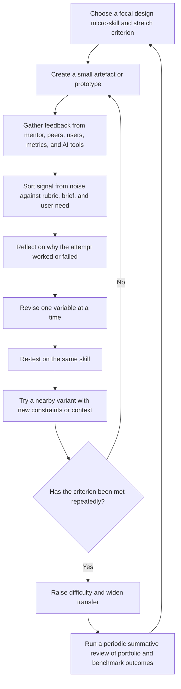

# Deliberate Practice and Feedback Loops in Creative and Design Skill Acquisition

## Executive summary

In the classic expert-performance formulation associated with entity["people","K. Anders Ericsson","expertise researcher"], deliberate practice is not ordinary repetition. It is focused work on specific weaknesses under conditions that support correction, concentration, and repeated refinement. That model travels well into some parts of creative and design learning, but only if it is adapted for design’s distinctive conditions: ill-defined problems, multiple valid solutions, evolving criteria, and evaluation that is partly social and contextual rather than purely rule-based. In music and chess, the performance target is relatively stable; in design, the target often co-evolves with the problem, the audience, and the medium. (Ericsson et al., 1993; Ericsson, 2019; Cross, 2004; Tan, 2021; Crilly, 2021) citeturn26search2turn10search3turn14view3turn14view2turn14view5

Feedback loops improve creative skill through several mechanisms at once. They reduce discrepancies between intention and outcome, redirect attention to the task rather than the ego, broaden perspective through peer, mentor, and user viewpoints, and help designers build better self-monitoring. The most effective feedback in this literature is usually formative, task- or process-focused, sufficiently specific to guide the next move, and delivered in a psychologically safe setting. Feedback is not automatically beneficial: classic feedback-intervention work found a moderate average effect on performance, but more than one-third of interventions reduced performance. In design studios especially, harsh or identity-threatening critique can suppress learning even when the technical content of the criticism is sound. (Hattie & Timperley, 2007; Shute, 2008; Kluger & DeNisi, 1996; Gong et al., 2017; Dannels & Martin, 2008; Ezennia & Agbonome, 2025) citeturn14view6turn14view7turn32search11turn14view8turn39view0turn17view7

For design, the practical unit of deliberate practice is usually not “do another whole project.” It is a micro-skill embedded in authentic work: framing a brief, interviewing users, generating alternatives, constructing visual hierarchy, sketching form, prototyping states, conducting comparative critique, or explaining a rationale. Strong programmes alternate tight drills and broader project cycles. They front-load problem framing, maintain repeated making-and-revision loops, vary constraints to prevent fixation, and separate formative critique from summative judgement. Evidence from design education also suggests that user feedback early in the process can improve empathy and ideation, and that structured peer-review systems can elicit useful critique at scale. (Chen et al., 2022; Chen, 2025; Bawabe et al., 2021; Motley, 2017; IDEO, 2019) citeturn27view4turn27view2turn15view7turn13search10turn17view4turn40view0

Assessment is the weak link in much of the literature. Self-assessments are useful for reflection but insufficient on their own. Robust measurement of creative growth usually requires triangulation: expert judgement, structured rubrics, domain-specific proxies, and longitudinal evidence of improvement across time. In design research, the Consensual Assessment Technique and the Creative Product Semantic Scale remain important, but inter-rater reliability depends on judge expertise, task framing, and rating instructions. Recent reviews also show that creativity-training studies often report moderate positive effects, while transfer to delayed, real-world behaviour remains under-measured. (Li et al., 2024; Jeffries, 2015; Christiaans & Venselaar, 2005; Yin et al., 2021; Sio & Lortie-Forgues, 2024; McKay et al., 2024) citeturn15view4turn30search4turn30search1turn15view6turn15view1turn33search1

The most defensible implementation strategy is therefore hybrid: small, frequent formative loops; periodic summative benchmarks; critique norms that protect candour without humiliation; multi-source feedback from peers, mentors, users, and tools; and scheduled recovery so practice intensity does not turn into burnout. (Liu et al., 2016; Byron & Khazanchi, 2012; Huang et al., 2025; Głaziewicz & Golonka, 2024; entity["people","Amy Edmondson","organizational scholar"] & Bransby, 2023) citeturn19view2turn19view3turn19view1turn34view0turn37view0

## Conceptual foundations

Deliberate practice is best understood as structured practice designed to improve performance on a defined aspect of a skill, not simply time spent doing the activity. In Ericsson’s original account, expert performance emerges from prolonged efforts to improve, supported by practice conditions that enable problem solving, evaluation, and repeated refinement. Later clarifications emphasised that research should measure the quality of practice, not only the quantity of hours. For creative and design learning, that means the key question is not “how much studio time happened?” but “how much of that time targeted a specific weakness under informative feedback?” (Ericsson et al., 1993; Ericsson, 2019) citeturn26search2turn10search3

That said, the strongest claims made on behalf of deliberate practice have not survived intact. Meta-analytic and review work argues that practice matters substantially, but it is not sufficient on its own to explain expertise. In the Macnamara meta-analysis, practice explained 26% of performance variance in games, 21% in music, 18% in sport, 4% in education, and less than 1% in professions; Hambrick and colleagues subsequently argued for a multifactor view in which practice interacts with other variables rather than crowding them out. The practical implication for design is not to abandon deliberate practice, but to stop treating it as a complete theory of creative excellence. (Macnamara et al., 2014; Hambrick et al., 2020) citeturn14view0turn28search0

A feedback loop, in this context, is the recurring cycle by which a learner compares output against a goal, notices discrepancy, revises action, and monitors the result. Hattie and Timperley treat feedback as a major influence on learning whose effects vary by type and delivery. Shute defines formative feedback as information intended to modify a learner’s thinking or behaviour to improve learning, and emphasises that it should be nonevaluative, supportive, timely, and specific. Kluger and DeNisi’s Feedback Intervention Theory goes further and argues that feedback works mainly by shifting attention; it improved performance on average in their meta-analysis, but more than one-third of interventions made performance worse. For design education, the lesson is straightforward: feedback must be treated as a carefully designed intervention, not as a ritualised opinion exchange. (Hattie & Timperley, 2007; Shute, 2008; Kluger & DeNisi, 1996) citeturn14view6turn14view7turn32search11

A rigorous account of creative skill acquisition therefore needs both ideas together. Deliberate practice supplies the structure of stretch, repetition, and micro-skill targeting; feedback loops supply the mechanism of calibration, correction, and adaptation. In design fields, those loops also include social judgement, user response, and reflective reframing, which means the loop is both cognitive and socio-material. (Tan, 2021; Crilly, 2021; Dannels et al., 2008) citeturn14view2turn14view5turn39view1

## Domain-based practice and design practice

In domain-based activities such as music and chess, deliberate practice is comparatively straightforward to operationalise. The rules are relatively stable, performance targets are reproducible, errors are more easily identified, and drill design can isolate subskills with relatively clear standards. This is one reason practice–performance relationships have been studied more extensively and often more cleanly in those domains than in occupations or creative professions. (Ericsson et al., 1993; Macnamara et al., 2014; Cross, 2004) citeturn26search2turn14view0turn14view3

Design differs in at least four important ways. First, the problems are often ill-defined. Second, problem and solution development frequently co-evolve rather than proceeding in a linear sequence. Third, evaluation depends on multiple criteria at once: novelty, usefulness, coherence, craft, stakeholder fit, and often ethical or commercial considerations. Fourth, learning is socialised through critique, explanation, and negotiated judgement. Cross called attention to design expertise as partly different from expertise in other fields; Tan later argued that no single model, including deliberate practice, fully captures how design expertise develops in practice. Crilly’s review of co-evolution makes the same point from another angle. (Cross, 2004; Tan, 2021; Crilly, 2021) citeturn14view3turn14view2turn14view5

Empirical work on novice and expert designers supports this distinction. In one IJDesign study, experts and novices broadly followed similar phases, but experts entered sustained design activity earlier and could remain in it for longer; novices tended to re-open earlier phases later, apparently compensating for incomplete framing. Experts also showed more schema-driven confidence in scoping the problem. This suggests that “practice” in design must include not only production skill but also problem framing and reframing. (Chen et al., 2022) citeturn27view4turn27view2

Studio pedagogy adds another layer. Critique is not merely an information-transfer device; it also socialises learners into disciplinary ways of speaking, defending intent, and making autonomous judgements. That is powerful, but it also means design feedback can drift away from workplace realities if the critique culture becomes overly performative or detached from users, constraints, and implementation. Dannels and Martin explicitly warned that critique may socialise identities reflective of academic ideals more than actual professional settings. (Dannels & Martin, 2008; Dannels et al., 2008; Motley, 2017) citeturn39view0turn39view1turn17view4

The implication is that deliberate practice in design should be built on a two-level architecture. At the micro level, learners should practise decomposable subskills: visual hierarchy in graphic design, interview synthesis and interaction-state design in UX, concept sketching and form exploration in industrial design, and trade-off communication in product design. At the macro level, they still need full projects in which ambiguity, stakeholder negotiation, and iterative reframing are part of the task. If training only drills micro-skills, it produces technically tidy but strategically shallow designers; if it only assigns big projects, improvement is too noisy and slow. (Tan, 2021; Chen et al., 2022; entity["organization","IDEO","design company palo alto, ca, us"], 2019) citeturn14view2turn27view4turn40view0

## How feedback loops improve creative skill

Feedback loops improve design capability through discrepancy reduction. Designers form an intention, externalise it in a sketch, prototype, mock-up, wireframe, or explanation, and then compare what appears against what was intended. Hattie and Timperley’s broad learning model and Kluger and DeNisi’s attentional account are compatible here: effective feedback reduces the gap between current and desired performance partly by returning attention to the task and the criteria that matter next. In design, externalisation is crucial because it makes taste, judgement, and reasoning discussable rather than private. (Hattie & Timperley, 2007; Kluger & DeNisi, 1996) citeturn14view6turn32search11

A second mechanism is perspective expansion. Creative performance seldom improves from one perspective alone. User feedback reveals fit with actual needs; peer feedback reveals alternative framings and comparative standards; expert critique surfaces domain principles and trade-offs; self-reflection integrates all three into a more portable mental model. A study of design-based projects found that user feedback delivered early, in the empathising stage, improved empathy, problem understanding, and ideation. That is a reminder that feedback is not only for evaluation after making; it can also shape the way the problem itself is understood. (Chen, 2025; Crilly, 2021) citeturn15view7turn14view5

A third mechanism is affective regulation. Supportive feedback environments are associated with creative performance partly through affect and partly through greater willingness to monitor and seek feedback. Work in organisations shows that supportive supervisor and coworker feedback environments can influence creativity indirectly through positive affect or through feedback-monitoring behaviour. Peer feedback seeking is also more likely under psychologically safe conditions and, at team level, has been linked to stronger creativity. This matters directly for design critique: if the room feels unsafe, the loop narrows because learners hide uncertainty, over-defend weak ideas, or avoid experimentation. (Gong et al., 2017; Liu et al., 2021; De Stobbeleir et al., 2011; De Stobbeleir et al., 2020; Edmondson & Bransby, 2023) citeturn14view8turn15view3turn18search3turn37view2turn37view0

A fourth mechanism is representational refinement. Feedback is most valuable when it teaches the learner how to see the work differently, not merely that the work is “good” or “bad.” In graphic design classrooms, critique helps students become better observers of disciplinary criteria. In broader design education, critique feedback also trains interaction management, explanation of visuals, and advocacy of intent. Those are not ornamental speaking skills; they are part of how designers inspect, defend, and revise representations. (Motley, 2017; Dannels et al., 2008) citeturn17view4turn39view1

The table below summarises the main feedback variants and their trade-offs. It synthesises educational meta-analyses, design-studio studies, UX practice guidance, and recent work on AI-assisted feedback. (Hattie & Timperley, 2007; Shute, 2008; Double et al., 2020; Zhan et al., 2023; Chen, 2025; Ba et al., 2025; Alghamdi et al., 2025; Kendrick, 2019) citeturn14view6turn14view7turn25search9turn25search8turn15view7turn17view2turn17view3turn40view2

| Dimension | Variant | Main advantages | Main risks or limits | Best use in design learning |
|---|---|---|---|---|
| Goal of feedback | Formative | Steers revision while work is still changeable; supports iteration and learning-by-doing | Can blur into endless revision if criteria are unclear | Prototypes, sketches, works-in-progress, critique rounds |
| Goal of feedback | Summative | Establishes benchmarks, tracks change over time, supports comparability | Too late to support immediate learning if used alone | End-of-project reviews, portfolio milestones, benchmark UX tests |
| Source | Peer | Scales well; exposes learners to diverse alternatives; giving feedback also deepens judgement | Quality varies without rubrics, exemplars, or reviewer training | Studio critique, comparative review, peer ranking of alternatives |
| Source | Mentor or expert | High-signal critique on principles, trade-offs, and craft; better calibration of standards | Resource-intensive; can over-direct if mentors prescribe solutions | Key checkpoints, technical quality, project framing, transfer coaching |
| Source | User or stakeholder | Validates needs, context, comprehension, usability, and desirability | Users reveal fit better than they prescribe design; feedback can be noisy or local | Problem framing, prototype tests, experience evaluation |
| Source | Automated or AI | Immediate, scalable, always available, useful for first-pass critique and idea prompts | Bias, opacity, shallow pattern-matching, and risk of replacing human judgement | Early ideation, low-stakes iteration, rubric reminders, feedback rehearsal |
| Timing | Immediate | Strong for procedural and prototype-adjustment tasks; quick correction reduces drift | Can interrupt higher-level reflection if overused | Sketch drills, interface-state practice, tool technique, quick usability checks |
| Timing | Batched or delayed | Encourages synthesis across patterns and may reduce constant interruption | Slower correction; weaker for fragile early habits if gaps persist | Weekly reviews, portfolio reflection, after-action analysis |
| Specificity and level | Specific, task-/process-focused | Gives an actionable next step; improves self-monitoring and revision | Can become over-prescriptive if it dictates the exact solution | Revision notes tied to criteria, worked examples, annotated mark-ups |
| Affective tone | Supportive, candid, non-humiliating | Preserves motivation and psychological safety while keeping standards high | Too soft a style can become vague or unchallenging | Regular critique culture, beginner phases, high-ambiguity exploration |
| Affective tone | Person-focused or threatening | Occasionally produces short-term compliance | Often shifts attention to ego, narrows exploration, and suppresses risk-taking | Generally to be avoided in creative learning systems |

Timing deserves special caution. The literature consistently treats it as important, but not reducible to a single rule. Hattie and Timperley explicitly discuss timing as a thorny issue; Shute also notes that feedback can be useful at different moments depending on the task. In one experiment on multimedia learning, immediate feedback outperformed delayed feedback, and adaptive feedback outperformed simpler forms, especially on post-test scores and germane cognitive load. For design, the safest conclusion is that timing should be matched to the learning objective: use fast loops for fragile procedural skills and delayed synthesis for broader reflective judgement. (Hattie & Timperley, 2007; Shute, 2008; Taxipulati et al., 2021) citeturn14view6turn14view7turn20view0

## Designing deliberate practice tasks in design

The most important design decision in deliberate practice is decomposition. Good studios and workplaces do not treat “be more creative” as a usable target. They convert it into micro-skills that can be practised, observed, critiqued, and repeated. In graphic design, these include contrast control, spacing, hierarchy, type pairing, and rationale writing. In UX, they include problem framing, interview synthesis, flow mapping, state design, hypothesis generation, and test moderation. In industrial and product design, they include sketch fluency, reference abstraction, form-function trade-offs, model fidelity choices, and communicating manufacturability constraints. This follows directly from the deliberate-practice emphasis on specific aspects of performance and from design-expertise work showing that framing quality changes downstream behaviour. (Ericsson, 2019; Tan, 2021; Chen et al., 2022) citeturn10search3turn14view2turn27view4

Repetition matters, but only repetition with contrastive revision. Design learners improve faster when one variable is changed at a time and the effect is inspected. Industry sprint practice illustrates the principle well: create a lightweight prototype, test the critical hypothesis, collect immediate user feedback, fold the learning into the next loop, and keep variables limited so the signal is interpretable. That is a much more deliberate form of iteration than simply “doing many versions.” (IDEO, 2019) citeturn40view0

Variability is the antidote to narrow overfitting. If practice drills are always run on the same brief, same audience, same visual style, or same fidelity level, learners may become good at a surface pattern rather than the transferable principle. Design expertise research suggests that experts reframe and scope problems more strategically than novices; training should therefore vary brief type, user type, medium, and constraint set while keeping the focal micro-skill stable. A useful template is “same skill, new conditions”: for example, train hierarchy in poster design, onboarding screens, and product packaging rather than only in one artefact class. This is an inference drawn from deliberate-practice theory together with design-expertise evidence on framing and sustained activity. (Chen et al., 2022; Tan, 2021) citeturn27view2turn14view2

Constraints are especially important in design practice. The literature does not support a simplistic “more freedom equals more creativity” view. Constraint research in design and creativity shows a more ambiguous picture: constraints can focus search, force prioritisation, and produce parsimonious solutions, yet excessive stress and time pressure can impair creativity. In design pedagogy, useful constraints are selective and generative: one typeface family, one user segment, one manufacturing method, one interaction pattern, one cost ceiling, one material, one accessibility target. Harmful constraints are usually those that overload attention or eliminate meaningful exploration. (Onarheim, 2012; Scopelliti et al., 2014; Huang et al., 2025) citeturn29search21turn29search25turn19view1

Scaffolding determines whether peer and automated feedback become developmental rather than noisy. Reviews of peer assessment show that it works best when learners have explicit criteria, examples, and opportunities to apply feedback before final judgement. In design education, comparative systems such as UX Factor have shown that structured peer review can elicit high-quality feedback at scale, while early user-feedback strategies can improve both empathy and ideation. AI tools add speed and availability, but recent reviews argue that they should augment rather than replace human educators because the evidence base is still dominated by short-term studies and there are unresolved issues around bias, transparency, and pedagogy. (Double et al., 2020; Zhan et al., 2023; Fleckney et al., 2025; Bawabe et al., 2021; Chen, 2025; Ba et al., 2025; Alghamdi et al., 2025; Schmitt-Fumian et al., 2025) citeturn25search9turn25search8turn25search11turn13search10turn15view7turn17view2turn17view3turn24search2

The loop below shows what an iterative deliberate-practice cycle looks like when applied to a live design project rather than an abstract exercise. It reflects both studio pedagogy and rapid user-centred practice: focal goal setting, small artefacts, multi-source feedback, reflection, one-variable revision, and periodic benchmark reviews. (Ericsson, 2019; Hattie & Timperley, 2007; IDEO, 2019; NN/g, 2019) citeturn10search3turn14view6turn40view0turn40view2

## Measuring growth in creative skill

Creative growth should be measured with triangulation, not a single score. Recent review work in design education found that creativity self-assessments are useful but fragmented, and recommended balancing them with more performance-oriented approaches. In practice, a robust measurement stack usually combines reflective self-report, expert judgement, structured rubrics, and domain-specific performance proxies. (Li et al., 2024) citeturn15view4

Qualitative rubrics remain indispensable because design quality is partly interpretive. Good rubrics typically separate originality from usefulness, and both from execution. Studies in first-year design studios have identified multiple factors underlying design creativity rather than a single dimension, while the Creative Product Semantic Scale operationalises product evaluation through novelty, resolution, and style. For graphic and product design, that means a strong assessment rubric should explicitly distinguish “interesting idea,” “fit for purpose,” and “quality of realisation” instead of collapsing them into one vague notion of creativity. (Demirkan & Afacan, 2012; O’Quin & Besemer, 1989) citeturn31search2turn30search2

Objective proxies are still valuable, but they must be treated as proxies rather than full measures of creativity. In UX practice, entity["organization","Nielsen Norman Group","ux research firm fremont, ca, us"] distinguishes formative and summative evaluation and recommends metrics such as success rate and time on task for benchmark comparisons. Those measures can tell you whether a design is more usable, but not by themselves whether the design move was genuinely creative. The right strategy is therefore to combine objective outcomes with expert judgement of the concept and the rationale. (Kendrick, 2019; Benedek et al., 2024) citeturn40view2turn10search8

Inter-rater reliability is a central technical issue. In graphic design, Jeffries showed that CAT-based ratings can achieve acceptable reliability and that instructions to discount technical execution can improve consistency; later work also reported strong inter-rater agreement for creativity when judges were explicitly focused on creativity rather than craft alone. In design engineering, Christiaans and Venselaar reported high reliability coefficients for creativity ratings. Product-design comparison studies likewise suggest that when non-expert raters are used, CPSS-based ranking may be more reliable than looser consensual judging. The broad measurement lesson is simple: judge selection, rater training, and scoring instructions are not administrative details; they are part of the assessment instrument. (Jeffries, 2015; Jeffries et al., 2017; Christiaans & Venselaar, 2005; Yin et al., 2021) citeturn30search4turn30search19turn30search1turn15view6

For longitudinal measurement, the field still has a gap. Creativity-training meta-analyses consistently report weaker evidence for delayed behavioural transfer than for immediate learning gains. That suggests design educators and managers should track growth across repeated portfolio reviews, delayed re-performance tasks, transfer into new briefs, and eventually work outcomes such as user impact or product benchmark improvement. A practical longitudinal design is “baseline–midpoint–capstone–transfer”: score early work, score later work with the same rubric, and then test whether the same skill appears under genuinely new constraints. (Sio & Lortie-Forgues, 2024; McKay et al., 2024; Li et al., 2024) citeturn15view1turn33search1turn15view4

## Motivation, pedagogy, and workplace implementation

The literature on motivation suggests that creativity and design learning are helped by intrinsic motivation, creative self-efficacy, and prosocial motivation, all of which make unique contributions. At the same time, the rewards literature is more nuanced than the old “extrinsic motivation kills creativity” slogan. Creativity-contingent rewards can improve creative performance when paired with positive, task-focused feedback and autonomy, while completion-contingent or controlling rewards tend to be slightly negative. This is highly relevant to design schools and teams that over-rely on grades, approval rituals, or visible praise without giving designers real latitude. (Liu et al., 2016; Byron & Khazanchi, 2012) citeturn19view2turn19view3

Flow is related to, but not the same as, deliberate practice. Flow research describes an intrinsically motivating state associated with high challenge, high skill, clear goals, and control. Deliberate practice, by contrast, often asks the learner to stay at the edge of competence and work directly on weakness, which can be effortful and uncomfortable. For design education, the strongest interpretation is that flow is valuable for sustained engagement and productive making, but improvement still requires periodic movement out of fluent performance and back into targeted debugging. (Fong et al., 2015; Ericsson et al., 1993; Ericsson, 2019) citeturn35search0turn26search2turn10search3

Burnout is the main motivational constraint that practice-heavy systems often underestimate. A recent meta-analysis found an overall negative effect of experimentally induced stress on creativity, with stronger harm from non-social stressors such as time pressure and physical stress. Work on visual artists also found that art block was strongly associated with exhaustion and maladaptive perfectionism. For creative and design training, this implies that “tight deadlines to force creativity” is a risky norm: pace can sharpen decisions, but chronic overload erodes cognitive flexibility and exploration. (Huang et al., 2025; Głaziewicz & Golonka, 2024) citeturn19view1turn34view0

Pedagogically, the most robust implementation pattern is studio-plus-scaffold. Graphic-design research treats critique as a signature pedagogy because it teaches criteria, reflection, and self-assessment. Yet critique now needs redesign in two directions: first, towards greater psychological safety and explicit orientation for newcomers; second, towards closer alignment with contemporary distributed work practice. Recent reviews of architectural design studios note that traditional critique can feel threatening and insufficiently adapted to current professional realities, while post-pandemic design-teaching research reports growing use of online critique, self-paced demonstrations, and collaborative tools such as Miro and Slack in ways that better align with industry. (Motley, 2017; Ezennia & Agbonome, 2025; Fleischmann, 2025; Edmondson & Bransby, 2023) citeturn17view4turn17view7turn23view0turn23view1turn23view2turn37view0

For workplaces, the clearest industry example is rapid hypothesis-driven iteration. At entity["organization","IDEO","design company palo alto, ca, us"], sprint practice is framed around prototyping quickly, getting immediate user feedback, limiting variables so feedback is interpretable, and carrying learning from one short cycle into the next. That is a near textbook example of deliberate-practice logic adapted for open-ended design work. The caution, also stressed by IDEO’s broader design-thinking guidance, is that iteration without a solid foundation of study and criteria becomes superficial. (IDEO, 2019; IDEO, 2026) citeturn40view0turn40view1

## Evidence, recommendations, and open questions

The cumulative evidence is encouraging but incomplete. Across five decades of creativity-training studies, Sio and Lortie-Forgues reported a moderate average effect, yet also found widespread methodological weaknesses. In organisational settings, McKay and colleagues likewise found training to be effective overall and for learning outcomes, but not clearly effective for delayed behaviour transfer. Within design education specifically, newer studies show that user feedback can improve empathy and ideation, comparative peer review can elicit high-quality feedback at scale, and AI-generated feedback can support motivation and iterative refinement in ideation; however, the AI evidence remains short-term and small-sample. (Sio & Lortie-Forgues, 2024; McKay et al., 2024; Chen, 2025; Bawabe et al., 2021; Schmitt-Fumian et al., 2025; Alghamdi et al., 2025) citeturn15view1turn33search1turn15view7turn13search10turn24search2turn17view3

For educators and practitioners, the most actionable guidelines are these:

- Define target skills at the level of observable behaviour: not “be more creative,” but “generate five materially distinct concepts,” “write a stronger rationale,” or “improve onboarding-task completion.” (Ericsson, 2019; Chen et al., 2022) citeturn10search3turn27view4
- Separate formative critique from grading whenever possible, so learners can take risks without every experiment being judged as final performance. (Hattie & Timperley, 2007; Kendrick, 2019) citeturn14view6turn40view2
- Use multi-source feedback deliberately: peers for volume and comparison, mentors for principle-based diagnosis, users for problem fit, AI for rapid first-pass iteration. (Double et al., 2020; Chen, 2025; Ba et al., 2025; Schmitt-Fumian et al., 2025) citeturn25search9turn15view7turn17view2turn24search2
- Build critique norms that are candid but non-humiliating; psychological safety is not softness, it is the condition for honest experimentation. (Edmondson & Bransby, 2023; Sharma & Mehta, 2025) citeturn37view0turn37view1
- Practise with constraints, but make them selective and meaningful rather than globally oppressive. (Onarheim, 2012; Huang et al., 2025) citeturn29search21turn19view1
- Measure creative growth with triangulation and delayed checkpoints, not one-off grades or self-ratings. (Li et al., 2024; Jeffries, 2015; McKay et al., 2024) citeturn15view4turn30search4turn33search1
- Protect time for reflection after critique; feedback review without reflection leaves transfer on the table. (Yen et al., 2017) citeturn13search7
- Watch for the three common failure modes: vague critique, over-controlling rewards, and chronic overload masquerading as “creative pressure.” (Shute, 2008; Byron & Khazanchi, 2012; Głaziewicz & Golonka, 2024) citeturn14view7turn19view3turn34view0

Several research gaps remain open. The literature still lacks strong causal evidence on how deliberate-practice structures should differ by design subfield; better longitudinal studies connecting studio learning to workplace performance; stronger methods for measuring transfer across briefs and contexts; and clearer evidence on the optimal blend of human and AI feedback in creative work. There is also a persistent conceptual challenge: design research knows that problems and solutions co-evolve, but most intervention studies still measure learning as if the target were stable and singular. That mismatch may be the deepest reason why deliberate-practice ideas need adaptation rather than simple import into design. (Tan, 2021; Li et al., 2024; Sio & Lortie-Forgues, 2024; McKay et al., 2024; Alghamdi et al., 2025) citeturn14view2turn15view4turn15view1turn33search1turn17view3

A compact list of key references used above:

- Ericsson et al. (1993), *The Role of Deliberate Practice in the Acquisition of Expert Performance* — `https://gwern.net/doc/psychology/writing/1993-ericsson.pdf`
- Ericsson (2019), *Deliberate Practice and Proposed Limits on the Effects of Practice* — `https://www.frontiersin.org/journals/psychology/articles/10.3389/fpsyg.2019.02396/full`
- Hambrick et al. (2020), *Is the Deliberate Practice View Defensible?* — `https://www.frontiersin.org/journals/psychology/articles/10.3389/fpsyg.2020.01134/full`
- Hattie & Timperley (2007), *The Power of Feedback* — `https://journals.sagepub.com/doi/10.3102/003465430298487`
- Shute (2008), *Focus on Formative Feedback* — `https://journals.sagepub.com/doi/10.3102/0034654307313795`
- Kluger & DeNisi (1996), *The Effects of Feedback Interventions on Performance* — `https://www.mrbartonmaths.com/resourcesnew/8.%20Research/Marking%20and%20Feedback/The%20effects%20of%20feedback%20interventions.pdf`
- Cross (2004), *Expertise in Design: An Overview* — `https://www.sciencedirect.com/science/article/abs/pii/S0142694X04000316`
- Tan (2021), *Towards an Integrative Approach to Researching Design Expertise* — `https://www.sciencedirect.com/science/article/abs/pii/S0142694X21000284`
- Crilly (2021), *The Evolution of Co-evolution* — `https://www.sciencedirect.com/science/article/pii/S2405872621000915`
- Li et al. (2024), *Creativity Self Assessments in Design Education: A Systematic Review* — `https://doi.org/10.1016/j.tsc.2024.101494`
- Sio & Lortie-Forgues (2024), *The Impact of Creativity Training on Creative Performance* — `https://eprints.whiterose.ac.uk/id/eprint/209749/`
- McKay et al. (2024), *A Meta-analysis of Creativity Training in Organizational Settings* — `https://onlinelibrary.wiley.com/doi/full/10.1111/caim.12605`
- Chen (2025), *Exploring the Effects of a User Feedback Strategy on Students’ Creative Thinking in a Design-Based Project* — `https://www.sciencedirect.com/science/article/abs/pii/S1871187125001117`
- Bawabe et al. (2021), *The UX Factor* — `https://dl.acm.org/doi/10.1145/3479863`
- Jeffries (2015), *A CAT with Caveats* — `https://doi.org/10.1080/21650349.2015.1084893`
- Kendrick (2019), *Formative vs. Summative Evaluations* — `https://www.nngroup.com/articles/formative-vs-summative-evaluations/`
- IDEO (2019), *5 Tips for Running a Successful Design Sprint* — `https://www.ideo.com/journal/5-tips-for-running-a-successful-design-sprint`
- Ba et al. (2025), *Unraveling the Mechanisms and Effectiveness of AI-assisted Feedback in Education* — `https://doi.org/10.1016/j.caeo.2025.100284`
- Alghamdi et al. (2025), *Educators’ Reflections on AI-automated Feedback in Higher Education* — `https://www.frontiersin.org/journals/education/articles/10.3389/feduc.2025.1704820/full`
