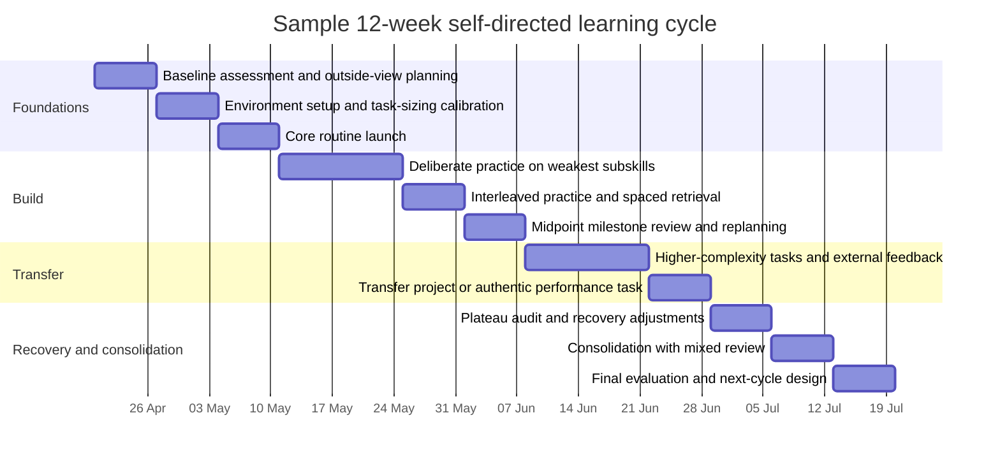

# Designing an Effective Self-Directed Learning Plan

## Executive Summary

An effective self-directed learning plan is best understood as a layered system rather than a single productivity method. At the top level, self-directed learning determines **who owns the learning agenda**; self-regulated learning provides the **cycle of planning, execution, monitoring, and reflection**; deliberate practice specifies **how to improve weak subskills**; and spaced retrieval and interleaving determine **how to make learning durable and transferable**. The strongest evidence base in the learning sciences favours self-regulated learning, practice testing, distributed practice, and well-designed feedback. Evidence for self-directed learning as a whole is positive, but much of the comparative evidence comes from health-professions and formal-education contexts, so transfer to independent adult learning should be made thoughtfully rather than assumed wholesale. citeturn22view0turn13search2turn28view1turn20view3turn21view0turn21view1turn21view2

For day-to-day execution, the central design problem is **task sizing**. Tasks should be small enough to begin without friction, but large enough to preserve context and produce meaningful outputs. Research supports segmenting work to manage limited working-memory resources, and direct studies of systematic breaks suggest that pre-planned break structures can reduce fatigue and distractedness relative to entirely self-regulated breaks. At the same time, timeboxing and Pomodoro-style methods have a thinner direct learning evidence base than spacing, retrieval, and feedback, so they should be treated as practical control mechanisms rather than as the core engine of learning. citeturn36view0turn25search1turn24view0turn23search2

Milestones work best when they combine three layers: **outcome goals** such as a finished project or test score, **capability goals** such as being able to solve a class of problems unaided, and **process goals** such as the number of high-quality practice sessions completed. Specific and challenging goals generally outperform vague “do your best” goals, but the popular SMART framework is better treated as a checklist than as a universal law, especially for exploratory or creative work. Learning objectives with observable behaviours, clear conditions, and explicit standards are often more useful than generic motivational goals. OKRs can help with quarterly alignment, but the academic evidence base for OKRs remains comparatively sparse. citeturn19search4turn19search21turn19search0turn19search2turn33view0turn33view1turn22view5

Progress tracking should privilege **leading indicators** that move before major outcomes do: focused practice blocks completed, retrieval accuracy, error types, review intervals met, and adherence to the weekly schedule. Self-monitoring and related monitoring tools show moderate positive effects on strategy use and academic performance, while dashboards appear most helpful when they aid participation and reflection rather than when they merely display data. Simple logs, review sheets, and annotated error journals are therefore usually more reliable than elaborate dashboards. citeturn35view0turn22view7turn22view8turn34view0

A plateau is not simply “feeling stuck”. Operationally, it is a period in which delayed recall, transfer performance, speed, or quality ceases to improve across repeated review cycles, despite continued effort. Common causes are massed practice masquerading as mastery, under-challenging tasks, repeated exposure without feedback, excessive fragmentation, or fatigue and boredom. The most reliable responses are to change the practice schedule rather than merely “try harder”: interleave confusable categories, increase retrieval and feedback, sharpen deliberate-practice targets, vary contexts, and restore recovery through sleep and breaks. citeturn9search3turn21view9turn22view3turn17search0turn31search5turn30view0turn32search4

## Assumptions and Scope

This report assumes an **unspecified adult learner** working largely independently, with access to ordinary digital tools such as a calendar, notes app, spreadsheet, or flashcard software. Because time availability was not specified, the templates and examples assume a **moderate commitment of roughly 5–7 hours per week**. If the learner has substantially more time, the same architecture still applies, but the weekly volume, feedback cadence, and project scope can be scaled up.

A second assumption is that the goal is **competence that transfers**, not just short-term completion or cramming. That matters because several techniques that improve immediate performance can produce misleading feelings of progress while yielding weaker delayed retention. Much of the strongest empirical foundation here comes from educational psychology, online and blended learning, and health-professions education; some practical recommendations for personal study are therefore carefully reasoned extrapolations from adjacent settings rather than direct one-to-one replications in hobbyist self-study. citeturn9search3turn13search2turn28view1turn28view0

Finally, the report treats methods such as timeboxing, Pomodoro, habit trackers, and dashboards as **support structures**. They are valuable when they enhance planning, monitoring, and recovery, but they do not replace evidence-based learning processes such as retrieval, spacing, interleaving, feedback, and reflection. citeturn20view3turn21view0turn21view1turn22view3turn35view0

## Evidence-Based Learning Frameworks

Self-regulated learning is the most useful backbone for a self-directed plan because it describes learning as a recurring loop of **forethought, performance, and self-reflection**. In the forethought phase, the learner analyses the task, sets goals, and plans strategies. In the performance phase, the learner executes while monitoring progress and regulating attention. In the reflection phase, the learner evaluates outcomes, attributes success or failure, and updates the next cycle. This is not just a conceptual model: meta-analytic evidence indicates that self-regulated learning interventions have a positive, moderate effect on academic achievement in online and blended settings. citeturn22view0turn13search2turn40search7

Self-directed learning is broader. It concerns ownership of the learning agenda: identifying needs, selecting resources, deciding what success looks like, and evaluating outcomes. Recent meta-analytic evidence in health-professions education suggests a small-to-moderate overall positive effect, with stronger results when self-directed learning is used as the core intervention rather than as a vague label. A more recent undergraduate medical-education meta-analysis also found self-directed learning more effective than traditional didactic learning for cognitive outcomes. The practical implication is that autonomy helps most when it is **structured**, not when it is merely left to chance. citeturn28view1turn28view0

Deliberate practice adds the improvement engine. Its value is not “putting in hours”, but **targeting specific weaknesses with concentration, analysis, and clear corrective feedback**. Meta-analytic work shows that deliberate practice explains meaningful but incomplete portions of performance variance, with stronger effects in structured domains such as games and music than in education or professions. Later clarification work argues that the original concept is often diluted when it is reduced to accumulated hours alone, and that the **quality and individualisation of practice** matter more than duration by itself. For self-directed learners, that means a good plan should include recurring sessions devoted to the hardest current subskill, not just more time on the subject overall. citeturn38view0turn22view4turn21view6

The most robust learning techniques for durable retention remain practice testing and distributed practice. Dunlosky and colleagues judged practice testing and distributed practice among the highest-utility techniques available to learners, and the spacing literature consistently shows better long-term retention when practice is spread over time rather than massed together. Practice testing is especially strong when feedback is included, because it both strengthens retrieval and prevents the consolidation of errors. citeturn20view3turn21view0turn21view1turn20view5

Interleaving is especially valuable when the learner must distinguish between similar categories, problem types, or linguistic forms. Importantly, interleaving often **feels worse during practice** and can reduce immediate homework performance, yet still improve later transfer and surprise-test performance. That is precisely why it is useful for plateau avoidance: it disrupts fluency illusions and forces problem discrimination and retrieval. citeturn21view2turn22view6turn21view9

Taken together, the strongest synthesis is this: use self-regulated learning as the control loop, self-directed learning as the ownership model, deliberate practice as the subskill-improvement mechanism, and spacing, retrieval, and interleaving as the memory-and-transfer schedule. citeturn22view0turn28view1turn38view0turn21view0turn21view1turn21view2

## Task Sizing for Daily Execution

Task sizing should be guided by three principles. First, every task needs a **clear done state**. Second, the task should fit within a realistic attention window and the learner’s current cognitive load. Third, estimates should rely on an **outside view** grounded in past similar tasks, because people systematically underestimate their own completion times. citeturn36view0turn26search1turn26search2

### Comparing task-sizing methods

| Method | Evidence and mechanism | Pros | Cons | Best use case |
|---|---|---|---|---|
| **Timeboxing** | Time management is moderately associated with academic achievement, job performance, and wellbeing, so fixing a time boundary can improve follow-through even when the exact task is not fully predictable. citeturn23search2turn23search5 | Prevents perfectionistic drift; protects study time; makes reviewing estimates easier. | Can reward mere occupancy if outputs are unclear. | Reading, drafting, exploratory problem-solving, review sessions. |
| **Pomodoro or systematic breaks** | In a real-life study-session experiment, systematic breaks produced less fatigue and distractedness and better concentration/motivation than self-regulated breaks, with similar task completion; a later scoping review also found consistent focus and fatigue benefits, though with limited high-quality trials. citeturn25search1turn25search2turn24view0 | Good for starting; supports effort regulation; helps prevent fatigue. | Interval length may be too short for deep synthesis or too rigid for flow. | Practice sets, revision, coding drills, vocabulary review, difficult but bounded work. |
| **Micro-tasks** | Microlearning reviews report gains in retention, engagement, completion, and self-efficacy when content is broken into small units. citeturn20view21turn21view8 | Low activation energy; ideal for daily consistency and spaced review. | Can fragment understanding if used for everything. | Flashcards, code katas, article annotations, pronunciation drills. |
| **Chunking** | Cognitive-load theory recommends structuring complex tasks to avoid overwhelming working memory; instructional design guidance also supports breaking larger goals into discrete skill components. citeturn36view0turn33view0 | Makes planning concrete; reduces overload; reveals subskills. | Over-chunking can destroy context and transfer. | New or complex material, multi-step projects, novices. |
| **Reference-class effort estimation** | Planning-fallacy research shows people underestimate their own task times; outside-view forecasting reduces this bias by comparing with similar past tasks. citeturn26search1turn26search2 | Improves schedule realism; lowers frustration from overcommitment. | Needs usable historical comparisons. | Weekly planning, project scoping, assignment estimates. |

A practical rule is to size a single task so that it can usually be completed in **one to two focused blocks**. If the estimated time exceeds that, the task is probably not yet a task but a project. For example, “learn Python functions” is too large; “complete ten function-tracing questions and correct errors in an error log” is a task. This is consistent with cognitive-load principles and with the measurement logic of learning objectives, which emphasise observable behaviours and explicit criteria. citeturn36view0turn33view0turn33view1

For estimation, a sensible synthesis is to use a compact outside-view process: identify the three most similar past tasks, take their median completion time, then add a contingency margin for novelty. That recommendation is an inference from planning-fallacy research rather than a universal constant, but it is more defensible than optimistic, inside-view guesses. citeturn26search1turn26search2

The main design risk is **over-fragmentation**. Small tasks improve starting, but if every session is reduced to tiny actions, the learner never practises integration. The antidote is to keep a weekly mix of short retrieval tasks, medium deliberate-practice tasks, and at least one larger integrative block for transfer. Microlearning should therefore complement, not replace, deeper work. citeturn21view8turn36view0turn21view9

## Milestones, Metrics, and Progress Tracking

Milestones should be layered. The most useful design is to set **outcome milestones** for the final aim, **capability milestones** for core subskills, and **process milestones** for the weekly behaviours that make progress likely. This structure avoids the two classic failure modes of self-study: over-focusing on inputs such as hours alone, or over-focusing on distant outcomes that provide no weekly steering signal. citeturn22view0turn35view0turn22view7

### Comparing milestone frameworks

| Framework | What it optimises | Strength | Limitation | Best use case |
|---|---|---|---|---|
| **SMART goals** | Clarity and monitorability. | Useful as a checklist for making goals specific and time-bounded. citeturn19search0 | Not a one-size-fits-all method; may be too rigid for exploratory or creative work. citeturn19search0turn19search2 | Near-term targets with clear criteria. |
| **Specific, challenging goals** | Effort and performance. | Strong empirical basis: specific, difficult goals generally outperform vague goals. citeturn19search4turn19search21 | Requires sufficient skill, commitment, and feedback; can distort behaviour if badly chosen. | Performance phases, test prep, project delivery. |
| **OKRs** | Alignment between a qualitative objective and measurable key results. | Helpful for quarterly focus and balancing ambition with metrics. | Academic literature is still relatively sparse and under-documented. citeturn22view5 | Medium-term themes across several learning activities. |
| **Learning objectives** | Observable mastery and assessment alignment. | Force the learner to specify behaviour, conditions, and standards. citeturn33view0turn33view1 | Less inspiring if written too mechanically. | Weekly milestones, unit goals, skill definitions. |
| **Hybrid scorecard** | Steering through both process and outcomes. | Combines leading and lagging indicators; aligns with self-monitoring evidence. citeturn35view0turn22view7 | Requires discipline to review regularly. | Most self-directed plans. |

The strongest recommendation is a **hybrid**. Write the overall ambition in plain language, translate it into a small set of measurable learning objectives, and then review it using a scorecard containing both process and outcome indicators. This captures the motivational benefit of ambitious goals without sacrificing assessability. citeturn19search4turn33view0turn35view0

Quantitative metrics are best when they capture behaviour or performance that matters directly: focused sessions completed, retrieval accuracy after seven days, error rate on a specific problem type, completion time, number of tutor corrections incorporated, or project milestones shipped. Qualitative metrics become valuable when the issue is regulation rather than output: boredom, confidence calibration, perceived effort, source of errors, and reflections on what strategy actually worked. Self-assessment research shows that structured self-assessment improves self-regulated learning and self-efficacy, which is why qualitative reflection should not be dismissed as “soft”. citeturn29view0turn22view7turn35view0

For tracking tools, simple solutions usually outperform ornate systems. A **daily log** captures what was planned, what was done, accuracy, friction, and the next action. A **weekly review** aggregates leading indicators, compares them with lagging outcomes, and decides whether the plan needs adjustment. Dashboards can help when they make progress visible and actionable, but reviews of learning analytics dashboards show limited evidence for major achievement gains and more consistent effects on participation. For independent learners, that means dashboards are useful only if they trigger decisions. citeturn22view8turn34view0turn35view0

Repeated behaviour in a stable context also matters. Habit-formation research suggests that automaticity grows gradually over repeated, context-linked practice rather than appearing instantly, so a sustainable plan should attach core study actions to recurring cues such as the same time of day or the same start ritual. In other words, habit trackers are useful not because streaks are magic, but because they support self-monitoring and context stability. citeturn15search2turn15search1turn15search6

## Plateau Detection and Recovery

A genuine plateau should be diagnosed with **data, not mood**. The clearest objective signals are flat delayed-recall scores, unchanged transfer performance, repeated error patterns, and stagnant speed or quality across multiple review points. A particularly important warning sign is when immediate practice feels easier and scores look good, yet delayed tests or novel tasks do not improve. The learning-science literature repeatedly warns that current performance is not the same thing as long-term learning. citeturn9search3turn21view1turn21view9

Subjective signals also matter because emotions are part of self-regulated learning rather than distractions from it. Rising boredom, avoidance, dwindling concentration, and lower motivation often indicate either insufficient challenge, excessive load, or a poor fit between task type and session structure. Recent reviews on emotions in self-regulated learning and related work on boredom and disengagement support taking these signals seriously as part of the control system. citeturn17search0turn17search8

A practical detection rule is to declare a plateau when **two or three consecutive review cycles** show no meaningful improvement on the metric that actually matters for the goal, while practice volume remains stable. This threshold is a pragmatic synthesis, but it is better than waiting until motivation collapses. citeturn35view0turn9search3

### Comparing interventions for plateaus

| Intervention | Why it works | Pros | Cons | Best use case |
|---|---|---|---|---|
| **Variation and interleaving** | Improves discrimination and retrieval across confusable categories; often boosts transfer more than blocked practice. citeturn21view2turn21view9 | Breaks fluency illusions; strengthens selection of the right method. | Feels harder; can depress immediate practice scores. | Maths problem types, grammar forms, debugging patterns, research methods. |
| **Sharper feedback** | Effective feedback clarifies the gap between current performance and the goal, but its impact depends on type and timing. citeturn22view3 | Corrects blind spots quickly; improves calibration. | Poor feedback can distract or demotivate. | Speaking, writing, code review, technical problem-solving. |
| **Deliberate-practice adjustment** | Progress often resumes when practice targets a narrow weak subskill rather than the whole domain. Quality, concentration, analysis, and problem solving are central. citeturn22view4turn21view6 | Efficient use of limited study time; high leverage. | Mentally demanding; requires diagnosis. | When one bottleneck is constraining everything else. |
| **Rest, micro-breaks, and sleep** | Short breaks improve vigour and reduce fatigue; sleep supports memory consolidation and next-day learning. citeturn30view0turn31search5turn32search4turn32search16 | Restores attention and reduces false plateaus caused by fatigue. | Does not fix a badly designed practice routine. | When concentration, mood, or retention deteriorate. |
| **Meta-learning audit** | Self-monitoring and self-assessment improve strategy use and performance; the learner may need to change method, not effort. citeturn35view0turn29view0turn22view7 | Reveals wasted effort; improves self-correction. | Easy to skip when frustrated. | When effort is high but progress is low. |
| **Environment redesign** | Habit-support methods work by stabilising cues, reducing friction, and lowering the cost of initiation. citeturn15search2turn15search6 | Helpful for consistency and restart after setbacks. | More useful for adherence than for skill diagnosis. | Missed sessions, procrastination, context switching. |

The best intervention depends on the diagnosis. If the learner is accurate in the session but forgets later, the issue is usually insufficient spacing or retrieval, so the remedy is more delayed recall and interleaving. If the learner cannot improve at all and keeps repeating the same defect, the issue is more likely a deliberate-practice problem, so the task should be narrowed and feedback improved. If the learner’s concentration, mood, and willingness collapse, fatigue may be the real bottleneck, and rest should be treated as part of the learning plan rather than as a deviation from it. citeturn21view0turn21view1turn21view9turn22view3turn30view0turn32search4

## Templates, Examples, and a Sample Twelve-Week Plan

The templates below synthesise the report’s main evidence-based principles: define observable objectives, size work realistically, track both process and outcomes, and include explicit plateau triggers and recovery responses. citeturn22view0turn33view0turn35view0turn22view3

### Personal planning template

```text
PERSONALISED SELF-DIRECTED LEARNING PLAN

Learning goal:
Why it matters:
Current baseline:
Time available per week:
Time horizon:

Outcome milestone:
- What finished competence or product will exist?

Capability milestones:
- Subskill 1:
- Subskill 2:
- Subskill 3:

Process targets:
- Focused sessions per week:
- Retrieval sessions per week:
- Feedback event per week:
- Review session per week:

Task-sizing rule:
- Default study block length:
- When to split a task:
- When to leave a task intact for integration work:

Lead indicators:
- Sessions completed
- Retrieval accuracy
- Error rate by category
- Planned vs actual time
- Reflection quality

Lag indicators:
- Quiz or test score
- Transfer task performance
- Project milestone completed
- Outside evaluation or feedback score

Plateau triggers:
- No improvement over ___ review cycles
- Same error pattern repeated ___ times
- Concentration rating below ___ for ___ sessions
- Missed sessions for ___ weeks

Recovery actions:
- Interleave topics
- Narrow to weakest subskill
- Add feedback
- Add sleep or recovery buffer
- Re-estimate scope with outside view
```

### Daily log template

```text
DATE:
Planned task:
Definition of done:
Estimated duration:
Actual duration:
Accuracy / completion:
Most common error:
Focus rating (1-5):
Effort rating (1-5):
What made this easier or harder?
Next action for the next session:
```

### Weekly review template

```text
WEEKLY REVIEW

What improved?
What stayed flat?
What got worse?
Which metric matters most for the real goal?
Did I mistake easy performance for learning?
What is the single weakest subskill now?
What will I stop doing next week?
What will I improve next week?
```

### Worked example for a language goal

Assumption: adult learner, lower-beginner to early-intermediate level, 6 hours per week, aiming to improve conversational ability and retention rather than exam cramming.

| Plan element | Example |
|---|---|
| **Goal** | Hold a ten-minute conversation on familiar topics and retain a core active vocabulary set after twelve weeks. |
| **Capability milestones** | Week 4: retain 200 high-frequency items at ≥85% on 7-day recall; Week 8: produce 3-minute monologues on three topics; Week 12: complete a ten-minute tutor conversation with reduced dependence on English. |
| **Weekly structure** | 5 × 15-minute spaced-retrieval sessions; 2 × 45-minute listening plus shadowing blocks; 1 × 60-minute speaking session with feedback; 1 × 45-minute writing-and-correction block. |
| **Lead indicators** | Seven-day recall accuracy, speaking minutes, number of corrected recurring errors, listening passage comprehension. |
| **Likely plateau** | Vocabulary review feels fluent, but speaking stalls and forms collapse in real conversation. |
| **Intervention** | Reduce blocked flashcard review, interleave speaking topics, convert recall into production tasks, and seek corrective feedback on one grammar bottleneck at a time. citeturn21view0turn21view1turn21view2turn22view3turn29view0 |

### Worked example for a programming goal

Assumption: novice learner building practical Python fluency with 6 hours per week.

| Plan element | Example |
|---|---|
| **Goal** | Build and document a working command-line data-cleaning script by week 12. |
| **Capability milestones** | Week 4: write functions, loops, and conditionals from memory in short exercises; Week 8: parse files and handle common errors; Week 12: ship a script with tests, README, and sample dataset. |
| **Weekly structure** | 3 × 30-minute retrieval-and-debugging sessions; 2 × 45-minute deliberate-practice blocks on weak topics; 1 × 90-minute project integration block; fortnightly code review from a peer or mentor. |
| **Lead indicators** | Number of tasks solved without notes, recurring bug categories, time-to-fix for similar bugs, test coverage for the current project. |
| **Likely plateau** | Tutorial completion remains high but independent coding remains slow and error-prone. |
| **Intervention** | Replace more tutorials with retrieval coding, interleave bug types, maintain an error log, and isolate whichever subskill is bottlenecking the project, such as file I/O or debugging control flow. citeturn38view0turn22view4turn21view9turn35view0turn22view3 |

### Worked example for a research goal

Assumption: self-directed learner preparing a literature-based brief on an unfamiliar topic with 5–7 hours per week.

| Plan element | Example |
|---|---|
| **Goal** | Produce a 1,500-word evidence brief and annotated literature matrix by week 12. |
| **Capability milestones** | Week 4: finalise question, search terms, and inclusion criteria; Week 8: complete annotated synthesis matrix; Week 12: write brief with claims traceable to sources. |
| **Weekly structure** | 2 × 45-minute search-and-screen blocks; 2 × 45-minute reading-and-notes blocks; 1 × 60-minute synthesis block; 1 × 30-minute weekly review of claims, gaps, and source quality. |
| **Lead indicators** | Sources screened, annotation quality, claim-evidence traceability, number of unresolved conceptual gaps, time needed to summarise one paper accurately. |
| **Likely plateau** | Reading volume increases, but synthesis quality and argument structure do not improve. |
| **Intervention** | Stop accumulating sources temporarily, switch to deliberate synthesis practice, ask for feedback on structure, and convert notes into explicit learning objectives such as “state the claim, evidence, limitation, and relevance for each study”. citeturn33view0turn22view3turn35view0turn34view0 |

### Sample twelve-week timeline

This example assumes a Monday start on 2026-04-20 and a moderate weekly time budget. The sequence deliberately alternates between build phases and review phases because spacing, feedback, and reflection improve the odds that progress is real rather than illusory. citeturn22view0turn21view1turn22view3turn35view0



## References

- *A Review of Self-Regulated Learning: Six Models and Four Directions for Research*. *Frontiers in Psychology*, 2017. citeturn22view0
- *A meta-analysis of the efficacy of self-regulated learning interventions on academic achievement in online and blended environments in K-12 and higher education*. *Behaviour & Information Technology*, 2022/2023. citeturn13search2turn40search7
- *Self-Directed Learning in Health Professions Education: A Systematic Review and Meta-Analysis*. *Perspectives on Medical Education*, 2026. citeturn28view1
- *Self-directed learning versus traditional didactic learning in undergraduate medical education: a systemic review and meta-analysis*. *BMC Medical Education*, 2025. citeturn28view0
- *Improving Students’ Learning With Effective Learning Techniques*. *Psychological Science in the Public Interest*, 2013. citeturn20view3turn21view0turn21view1turn21view2
- *Distributed Practice in Verbal Recall Tasks: A Review and Quantitative Synthesis*. 2006. citeturn20view5
- *The critical importance of retrieval for learning*. *Science*, 2008. citeturn12search3
- *Interleaved practice enhances memory and problem-solving ability in undergraduate physics*. *npj Science of Learning*, 2021. citeturn22view6turn21view9
- *Deliberate Practice and Performance in Music, Games, Sports, Education, and Professions: A Meta-Analysis*. *Psychological Science*, 2014. citeturn38view0
- *Deliberate Practice and Proposed Limits on the Effects of Practice on the Acquisition of Expert Performance*. *Frontiers in Psychology*, 2019. citeturn22view4turn21view6
- *Does time management work? A meta-analysis*. *PLOS ONE*, 2021. citeturn23search2turn23search5
- *Understanding effort regulation: Comparing “Pomodoro” breaks and self-regulated breaks*. *British Journal of Educational Psychology*, 2023. citeturn25search1turn25search2
- *Assessing the efficacy of the Pomodoro technique in enhancing anatomy lesson retention during study sessions: a scoping review*. *BMC Medical Education*, 2025. citeturn24view0
- *Microlearning beyond boundaries: A systematic review and a novel framework for improving learning outcomes*. 2025. citeturn20view21turn21view8
- *Cognitive-Load Theory: Methods to Manage Working Memory Load in the Learning of Complex Tasks*. *Current Directions in Psychological Science*, 2020. citeturn36view0
- *Building a practically useful theory of goal setting and task motivation*. *American Psychologist*, 2002. citeturn19search4
- *Being smart about writing SMART objectives*. 2017. citeturn19search0
- *Surveying the Academic Literature on the Use of OKR: An Update*. 2024. citeturn22view5
- *Learning Objectives*. 2023. citeturn33view0
- *Writing Learning Objectives*. 2023. citeturn33view1
- *Effects of self-assessment on self-regulated learning and self-efficacy: Four meta-analyses*. *Educational Research Review*, 2017. citeturn29view0
- *The effects of self-monitoring on strategy use and academic performance: A meta-analysis*. *International Journal of Educational Research*, 2022. citeturn35view0
- *Let Learners Monitor the Learning Content and Their Learning Behavior! A Meta-analysis on the Effectiveness of Tools to Foster Monitoring*. *Educational Psychology Review*, 2023. citeturn22view7
- *Learning Analytics Dashboard Design and Evaluation to Support Student Self-Regulation of Study Behaviour*. *Journal of Learning Analytics*, 2024. citeturn22view8
- *Have Learning Analytics Dashboards Lived Up to the Hype? A Systematic Review of Impact on Students’ Achievement, Motivation, Participation and Attitude*. 2024. citeturn34view0
- *The Power of Feedback*. *Review of Educational Research*, 2007. citeturn22view3
- *Learning Versus Performance: An Integrative Review*. *Perspectives on Psychological Science*, 2015. citeturn9search3
- *Emotions in self-regulated learning: A critical literature review and meta-analysis*. *Frontiers in Psychology*, 2023. citeturn17search0
- *Rest breaks aid directed attention and learning*. 2023. citeturn31search5
- *“Give me a break!” A systematic review and meta-analysis on the efficacy of micro-breaks for increasing well-being and performance*. *PLOS ONE*, 2022. citeturn30view0
- *Sleep after learning aids the consolidation of factual knowledge, but not relearning*. *Sleep*, 2021. citeturn32search4
- *A systematic and meta-analytic review of the impact of sleep restriction on memory formation*. 2024. citeturn32search16
- *How are habits formed: Modelling habit formation in the real world*. 2010. citeturn15search2